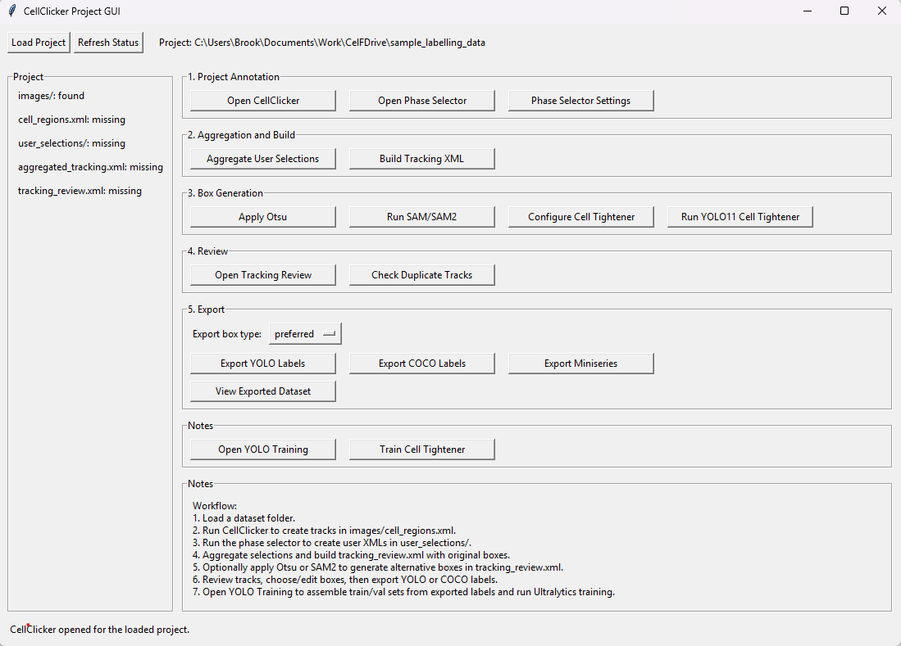
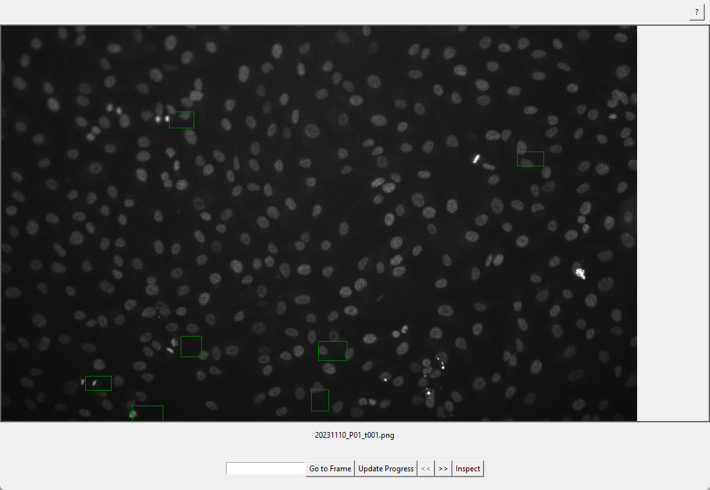
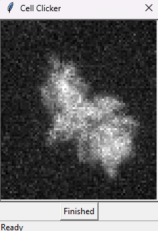
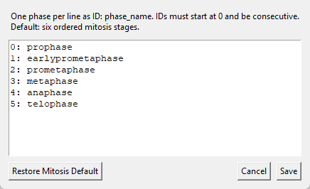
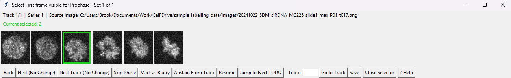
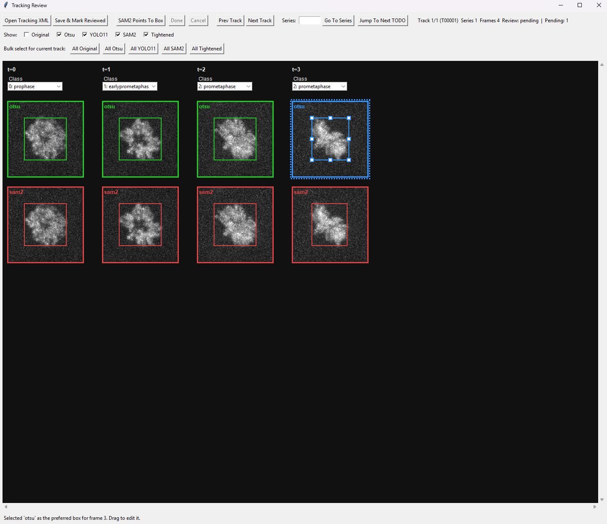
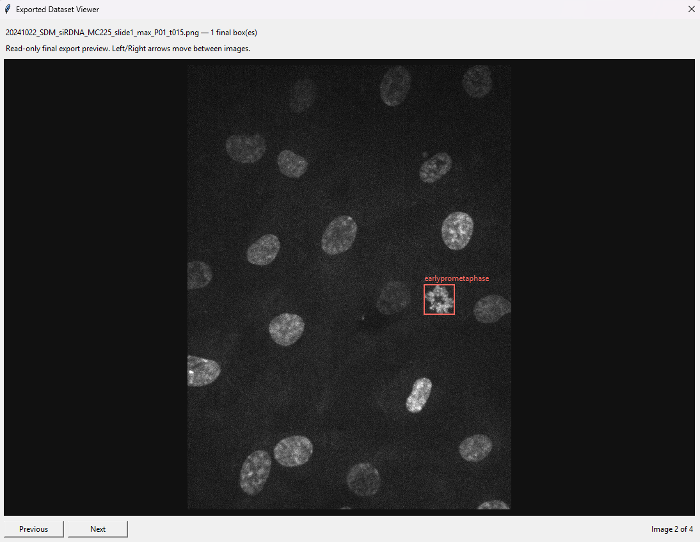
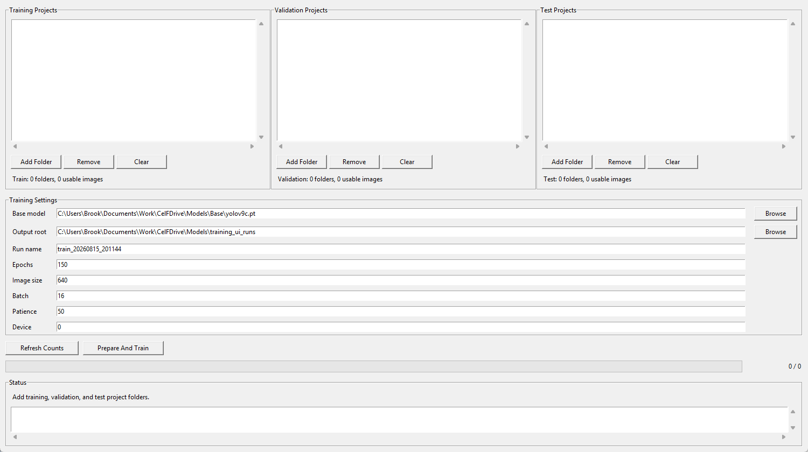
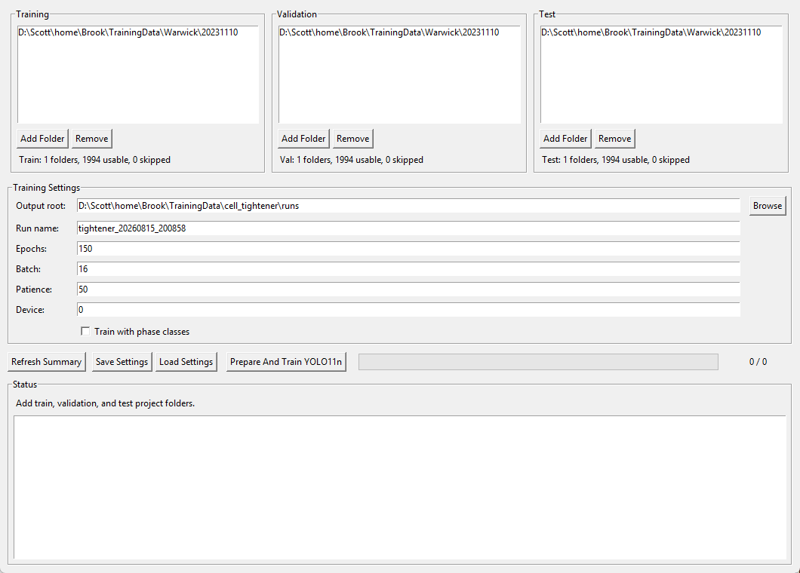

# CellClicker interface guide

This guide covers the complete project-GUI workflow: create cell tracks, select
phases, aggregate reviewers' choices, build and review tracking data, generate
alternative boxes, export labels, inspect the export, and train both a phase
model and a cell tightener.

The worked example is the existing project at
`D:\Scott\home\Brook\TrainingData\Warwick\20231110`. It is used here only
to show the interface. Do not run aggregation, rebuilds, exports, or training
in that folder just to follow the guide: those operations write project output.

## Before starting

Start the unified interface from the repository root:

```powershell
conda activate celfdrive-gpu
python run_gui.py
```

Most controls provide concise hover tooltips after the pointer rests over them
briefly. These tooltips explain the immediate action, required input or effect
of a setting in the project window, CellClicker, CellSelector, tracking review,
YOLO training and cell-tightener interfaces. Use the fuller workflow sections
below when choosing experiment-specific parameters or preparing irreversible
exports and training runs.

The active environment needs the packages in the supplied environment file.
YOLO11 training, SAM2, and the trained tightener additionally require
`ultralytics`; SAM2 also needs a compatible PyTorch CPU or CUDA installation.

A project directory must contain `images/`. The raw CellClicker track file is
`images/cell_regions.xml`. Existing projects containing only the legacy
misspelling `cell_reigons.xml` remain usable unchanged. When such a project is
loaded, the interface offers to rename the file to `cell_regions.xml`; choosing
No continues with the legacy file. Library and command-line lookups do not
rename files. If both files are present, the interface warns the user and uses
`cell_regions.xml`; it leaves both files unchanged. The interface writes all
downstream workflow files below `user_selections/`.

The GUI creates `user_selections/` when phase annotations are first saved.
Projects may be moved as complete folders. If a moved project's
`tracking_review.xml` still records paths below its former
`dataset_root/images/` directory, CelFDrive resolves those paths below the
current project's `images/` directory. It persists the repaired paths and
dataset root when the tracking XML is next saved.

```text
20231110/
├── images/
│   ├── 20231110_P01_t001.png
│   ├── ...
│   └── cell_regions.xml              # raw CellClicker tracks
└── user_selections/
    ├── <reviewer>.xml                # each reviewer's phase choices
    ├── aggregated_tracking.xml       # aggregation result
    ├── tracking_review.xml            # canonical review record
    ├── exported_labels/               # YOLO export
    └── exported_coco/                 # COCO export, if requested
```

Click **Load Project** and choose the project folder itself, for example
`D:\Scott\home\Brook\TrainingData\Warwick\20231110`, not its `images`
subfolder. The status panel on the left tells you which workflow inputs exist.
Use **Refresh Status** after changing files outside this window.



## Screenshot inventory

| Screenshot | Interface shown |
| --- | --- |
| `project-workflow.png` | Main CellClicker Project GUI and the complete workflow. |
| `cellclicker.png` | CellClicker main window for drawing an initial box and navigating tracks. |
| `cellclicker-inspect.png` | Inspect view for clicking the cell centre in the magnified region. |
| `phase-settings.png` | Phase selector vocabulary settings. |
| `phase-selector.png` | Phase Selector for choosing a phase's first visible frame. |
| `tracking-review.png` | Tracking Review for comparing and selecting box alternatives. |
| `exported-dataset-viewer.png` | Read-only review of final exported labels. |
| `yolo-training.png` | YOLO phase-model training interface. |
| `cell-tightener-training.png` | Cell-tightener training interface. |

The workflow is ordered. Finish every applicable step before moving to the
next one:

1. Create or correct raw tracks in CellClicker, then assign phases.
2. Aggregate all reviewers and build `tracking_review.xml`.
3. Generate optional box alternatives and review the chosen box for every
   frame.
4. Export a current snapshot, inspect it, then train.

## 1. CellClicker: make raw cell tracks

Open **Open CellClicker**. The large image view is the current frame. Use
`<<` and `>>`, the Left/Right arrow keys, or enter a frame number and click
**Go to Frame** to navigate. **Update Progress** reloads raw-track overlays
after changes. The `?` button lists the same shortcuts in the application.



To create a track:

1. Go to a frame where the cell is clear, then drag a red box around it.
2. Click **Inspect** (or press `I`). The mini-clicker opens on an earlier
   frame with a magnified region of interest.
3. Click the cell centre in each preceding image. Each click writes the next
   raw box in that track. Click **Finished** (or press `F`) when the cell is
   absent or the series is complete.
4. Return to the main window and use **Update Progress** if the green
   track boxes are not yet visible.



Green boxes are existing tracks. Right-click a green box and choose
**Extend earlier** when the same cell has a missing earlier timepoint. This
creates a new revision of only that raw series; it does not alter other tracks.
Only that series returns to each annotator's phase-selection queue, and
aggregation requires every annotator XML to select its current revision.
Rebuilding tracking review retains reviewed boxes on existing raw frames, gives
new frames their original boxes, and marks the series pending review.

Use the red **X** on a track's final box only to delete the whole raw track.
After confirmation, the project removes that series from phase selections,
aggregate, and review without changing other series IDs or reviews. Existing
exports become stale and must be recreated; complete exports remove files that
belong only to the deleted series.

## 2. Set the phase vocabulary

Before anyone starts selecting phases, choose **Phase Selector Settings**.
Enter one `ID: phase_name` pair per line. IDs must start at `0`, be consecutive
and unique; names must be unique and contain only letters, numbers, and
underscores. The order is the chronological order presented to selectors and
the class order used in exports and training.



The default mitosis vocabulary is:

```text
0: prophase
1: earlyprometaphase
2: prometaphase
3: metaphase
4: anaphase
5: telophase
```

Click **Save** to use your mapping, or **Restore Mitosis Default** to put back
that list. Changing the mapping invalidates existing phase selections. Every
reviewer must open the phase selector again and update their selections before
you can aggregate and rebuild.

## 3. Phase Selector: mark first visible frame

Choose **Open Phase Selector**. If the project has more than one annotator,
the selector asks for the reviewer identity so selections are kept in separate
`user_selections/<reviewer>.xml` files. Do not share one reviewer file between
independent reviewers.

For the phase named in the title, click the first thumbnail in the current
track where that phase is visible. The selector records the frame and advances
to the next requested phase or track.



The controls are:

| Control | Use |
| --- | --- |
| Thumbnail | Select the first frame where the current phase is visible. |
| **Back** / Left arrow | Return to the preceding phase without discarding a saved selection. |
| **Next (No Change)** / Right arrow | Move on without modifying this phase. |
| **Next Track (No Change)** | Move to another cell series without modifying the current one. |
| **Skip Phase** / `S` | Record that the current phase is not present in this track. |
| **Mark as Blurry** | Mark every phase in this track unavailable when it cannot be judged. |
| **Abstain From Track** | Record no opinion, so other reviewers can supply the selection. |
| **Resume** | Return to the next unfinished selection. |
| **Jump to Next TODO** | Find a track with missing or stale phase choices. |
| **Track** and **Go to Track** | Go directly to a one-based track number. |
| **Save** | Write the current selections to the reviewer's XML. |
| **Close Selector** | Exit without making a new selection; use **Save** first to persist work. |
| **? Help** | Show the in-app explanation and shortcuts. |

Use **Save** often. A reviewer whose raw track was extended earlier must update
only the revision-stale series, not every other series.

## 4. Aggregate selections and build tracking XML

When every reviewer has saved their choices, click **Aggregate User
Selections**. This creates `user_selections/aggregated_tracking.xml`. It checks
that reviewers' selections use the current phase mapping and raw-track
revisions; if it reports stale selections, return the indicated reviewer(s) to
the phase selector and save their updates.

Then click **Build Tracking XML**. This creates or reconciles
`user_selections/tracking_review.xml`, the canonical downstream record. It
contains each track, its chronological timepoints, the selected phase/class,
image paths, and normalized YOLO boxes. The initial alternative on each
timepoint is `original`.

Do not train directly from `cell_regions.xml` or `aggregated_tracking.xml`.
Review and export from `tracking_review.xml` instead.

### If you need to change and rebuild

Use the change that matches the problem:

| Change | Required follow-up |
| --- | --- |
| Phase names, IDs, or order changed | Have every reviewer update selections; aggregate; build tracking XML; review affected class choices; export again. |
| Raw track extended earlier in CellClicker | Have reviewers update the stale series; aggregate; build tracking XML; review new frames; export again. Existing reviewed boxes on unchanged raw frames are retained. |
| Raw track deleted | The project removes it from selections, aggregate, and review. Re-export; old export files are marked stale. |
| Phase choice or box changed in Tracking Review | Save & Mark Reviewed; export again. No aggregation or rebuild is needed. |
| Box-generation method rerun | Review the new alternatives, select preferred boxes, save, and export again. |

Always use the current workflow status rather than assuming an existing export
is valid. Training rejects stale exported labels.

## 5. Box generation and tracking review

The **Box Generation** row creates alternatives in `tracking_review.xml`; it
does not silently overwrite the raw annotation:

| Button | New box type | Purpose |
| --- | --- | --- |
| **Apply Otsu** | `otsu` | Generate a threshold-derived alternative. |
| **Run SAM/SAM2** | `sam2` | Generate a segmentation-derived alternative. |
| **Configure Cell Tightener** then **Run YOLO11 Cell Tightener** | `yolo11_tightened` | Use a trained tightener model selected by `best.pt`. |
| Drag handles in Tracking Review | `tightened` | Manually refine a box while preserving the source alternative. |

**Configure Cell Tightener** stores the selected `best.pt`, its training image
size, and the choice rule (prompt-centre/confidence or overlap) in the project
review XML. **Run YOLO11 Cell Tightener** uses that saved configuration. If no
detection is found it still writes an original-box fallback, so each timepoint
keeps a selectable variant.

Open **Open Tracking Review** to decide which variant is authoritative. It is
also where you can correct phase choices and create manual tightens.



In the review window:

- Use **Prev Track**, **Next Track**, **Series**, **Go To Series**, and
  **Jump To Next TODO** to navigate. The header reports the track, series,
  number of frames, review state, and pending count.
- Use the **Show** checkboxes to reveal variants. A tile's label identifies
  its variant (`original`, `otsu`, `sam2`, `yolo11_tightened`, or `tightened`).
- Click a tile to make that variant preferred for its frame. The green border
  is preferred; the blue dotted border is the focused tile.
- Choose the phase from the **Class** dropdown above each timepoint. A
  multiclass tightener prediction may display a red predicted class, but it is
  informational and does not change this dropdown.
- Drag a selected tile's edge or corner handle to refine its box. The edit is
  saved as `tightened` and becomes preferred for that frame.
- **All Original**, **All Otsu**, **All YOLO11**, **All SAM2**, and **All
  Tightened** apply a variant to every frame in the current track where it is
  available. Inspect the track after bulk selection; some frames may lack that
  variant.
- **SAM2 Points To Box** starts point mode. Click one tile, add one or more
  positive points on that same tile, then click **Done** to write/update its
  `tightened` box. **Cancel** abandons the point operation.
- Click **Save & Mark Reviewed** after every completed track or batch. This is
  the action that persists review choices.

## 6. Export and inspect data

In the main window, choose **Export box type** first:

- `preferred` is normally correct: it writes the per-timepoint choice made in
  Tracking Review.
- A named alternative exports that one box type only, and is useful for
  comparing methods. Only select it when that variant exists for all data you
  expect to export.

Then use the appropriate button:

| Button | Output | Use |
| --- | --- | --- |
| **Export YOLO Labels** | `user_selections/exported_labels/`, with one normalized YOLO `.txt` file per image | Model training and inspection. |
| **Export COCO Labels** | `user_selections/exported_coco/annotations.json` | COCO-compatible analysis or tooling. |
| **Export Miniseries** | `user_selections/exported_miniseries/` | Cropped cell time-series images. |

An export is a complete snapshot: files that belong only to deleted tracks are
removed. The exporter requires every source image referenced by the review XML
to be below the selected project's `images/` directory. It reports an
actionable error when the tracking XML metadata does not match the selected
project.

After a YOLO export, choose **View Exported Dataset**. This is a read-only
quality-control viewer, not an editor. It overlays final class-labelled boxes;
use **Previous**, **Next**, or the Left/Right arrow keys to inspect every
image. If a label is wrong, close the viewer, correct it in Tracking Review,
save, and export again.



## 7. Train a phase model (YOLO11)

Only train from reviewed projects with a current **Export YOLO Labels** result.
Each selected project needs `tracking_review.xml` and exported YOLO labels;
models and microscopy datasets are not bundled with this repository.
Open **Open YOLO Training** and add separate project folders to **Training
Projects**, **Validation Projects**, and **Test Projects**. A project must be
in exactly one split. Do not put the Warwick example project in all three
lists—the screenshot below is only an interface illustration.



Set:

- **Base model**: an available pretrained Ultralytics `.pt` checkpoint.
- **Output root** and **Run name**: a new, identifiable run location and name.
- **Epochs**, **Image size**, **Batch**, **Patience**, and **Device**: values
  appropriate for the data and available hardware. Use a small pilot run first
  to confirm the GPU/device and labels are accepted.

Click **Refresh Counts** to ensure each split has usable images. **Prepare And
Train** copies the current exported labels into each project's `labels/`
folder, writes the dataset YAML, trains the model, evaluates the best checkpoint
on the held-out test projects, and records the run summary and metrics. It may
take a long time; do not close the window while it is running.

Use **Save Configuration** to preserve all three split lists and the displayed
training settings in a versioned YAML file. **Load Configuration** restores the
same setup. Relative model, project, and output paths are interpreted relative
to the saved YAML file, so a configuration does not depend on the directory
from which CelFDrive was launched. Paths on another Windows drive remain
absolute.

The saved configuration can also run without the GUI, including in a remote or
headless environment:

```powershell
python train.py --config path\to\training.yaml
python train.py --config path\to\training.yaml --name another_run
```

The optional `--name` changes only the run name for that invocation. See
`examples/yolo_training.example.yaml` for the version 1 schema. Both entry
points use the same validation, dataset preparation, training, and held-out
test evaluation code. A successful run contains `training_config.yaml` with
resolved absolute paths, alongside the generated dataset YAML and CSV
summaries, so its inputs and settings can be audited later.

## 8. Train and use a cell tightener

A tightener learns to replace an initial box with the preferred, closely drawn
review box. Prepare this carefully:

1. Make **several small, independently sampled projects** rather than using
   one large project for every split.
2. For each project, build `tracking_review.xml`; then manually create or
   select `tightened` boxes for representative timepoints in Tracking Review.
   Make sure `tightened` is the preferred box for those curated examples and
   click **Save & Mark Reviewed**.
3. Include the small curated projects in exactly one of Training, Validation,
   or Test. Keep cells, imaging sessions, and near-duplicate series separated
   between splits to avoid optimistic metrics.

This deliberate small-dataset stage is important: loading a few good datasets
where reviewers have selected tightens teaches the tightener the desired box
boundary. Add more varied curated projects only after checking the first model's
review output.

Click **Train Cell Tightener**. Add folders to all three split panels, set the
run settings, and optionally enable **Train with phase classes** only when all
projects share exactly the same ordered phase mapping.



The default storage root is
`D:\Scott\home\Brook\TrainingData\cell_tightener\` (override with
`CELLCLICKER_TIGHTENER_STORAGE_ROOT`). The tool makes class-agnostic,
review-style crops around original boxes and labels each crop from its preferred
review box. It chooses a stride-compatible image size from the largest crop,
capped at 320 pixels. **Prepare And Train YOLO11n** writes a
`training_manifest.csv`, reports validation output each epoch, and evaluates
the best checkpoint on the held-out test set.

`training_manifest.csv` records every included or skipped timepoint, its source
project and image, selected preferred box, review-crop bounds, output crop and
label paths, and any skip reason.

To use the result in a project, return to the main GUI:

1. Click **Configure Cell Tightener** and choose the trained `best.pt`.
2. Click **Run YOLO11 Cell Tightener** to add `yolo11_tightened` alternatives.
3. Open Tracking Review, inspect them, select the best box or manually tighten
   it, then **Save & Mark Reviewed**.
4. Export a fresh YOLO or COCO snapshot before any new phase-model training.

When several tightener boxes are detected, the default selection is the
highest-confidence box containing the original prompt-box centre. If none
contains the centre, CelFDrive uses the greatest overlap with the prompt box.
**Configure Cell Tightener** can instead persist pure overlap or confidence
selection for a project.

## Legacy commands

`python -m CellClicker.legacy.run_clicker`,
`python -m CellClicker.legacy.run_selector`, and
`python -m CellClicker.legacy.run_conversion` remain available for existing
workflows. New projects should use the unified GUI so track identity and
review decisions are preserved before export.

## Final quality-control checklist

Before delivering data or starting a long training run, confirm:

- Every reviewer has saved current phase selections.
- `tracking_review.xml` was rebuilt after any raw-track or phase-setting
  change.
- Every reviewed track has a sensible class and preferred box.
- Tracking Review has been saved after the final edits.
- The selected export box type is intentional, usually `preferred`.
- The exported-dataset viewer shows correct labels and boxes.
- Training, validation, and test projects are distinct, current exports.
