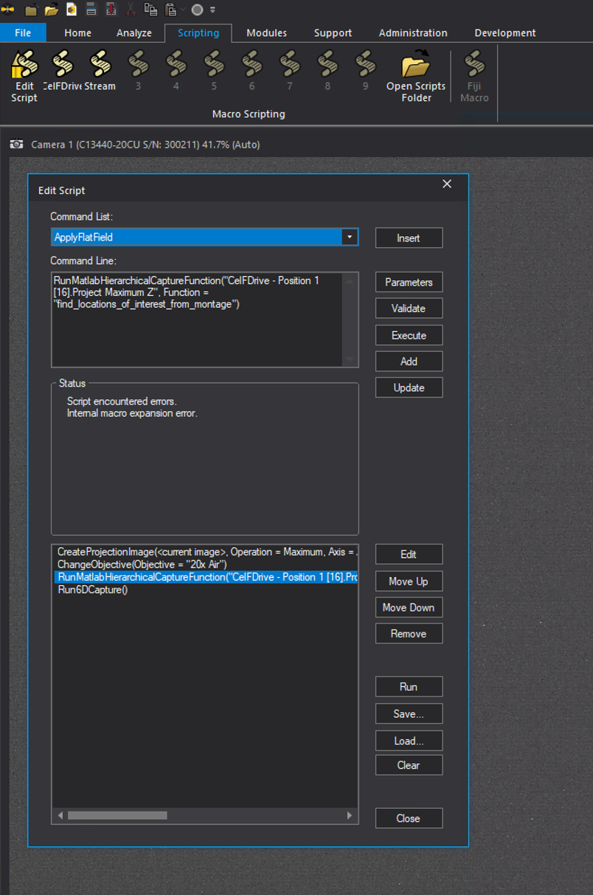
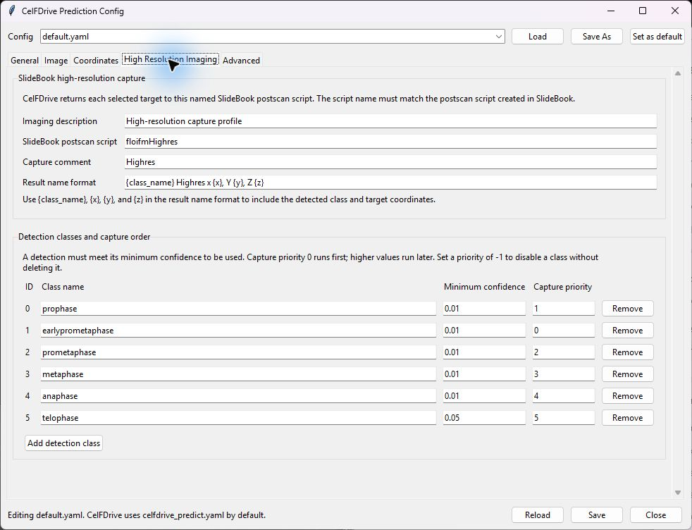
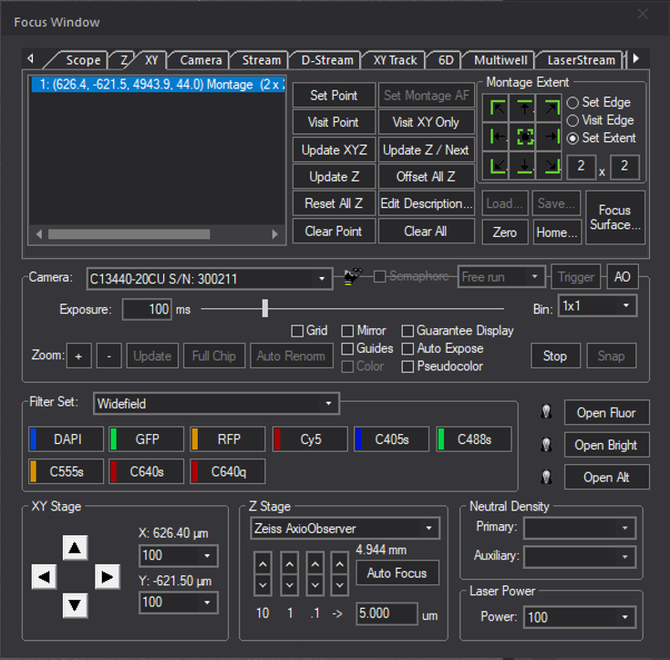
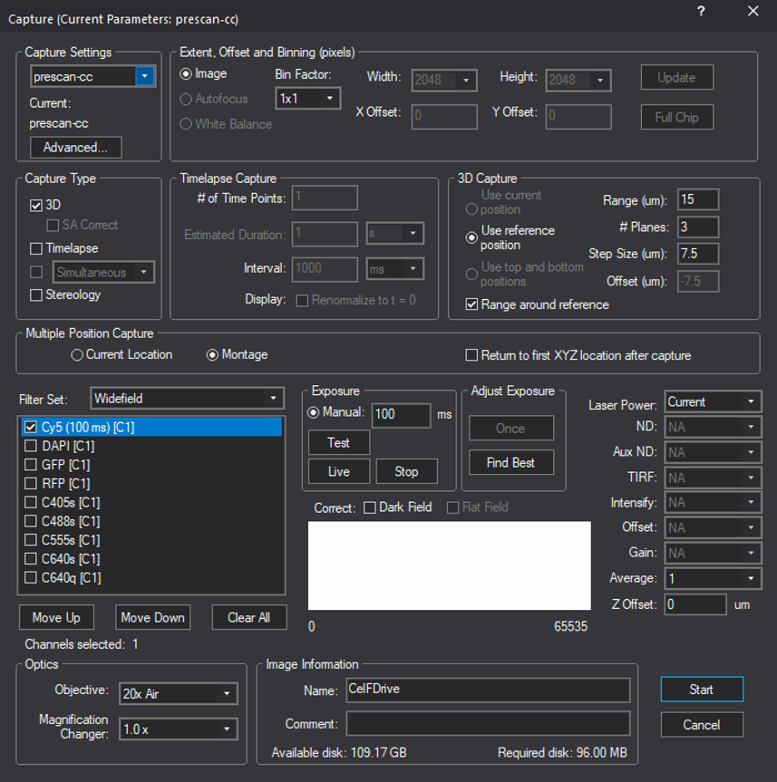
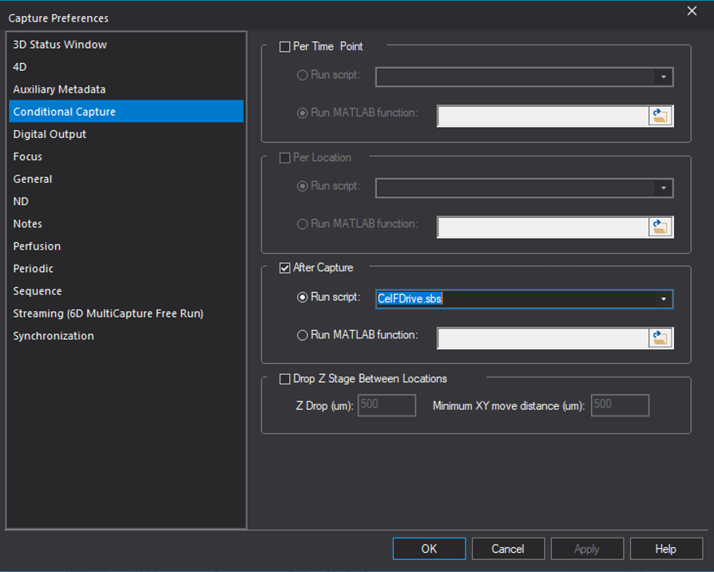
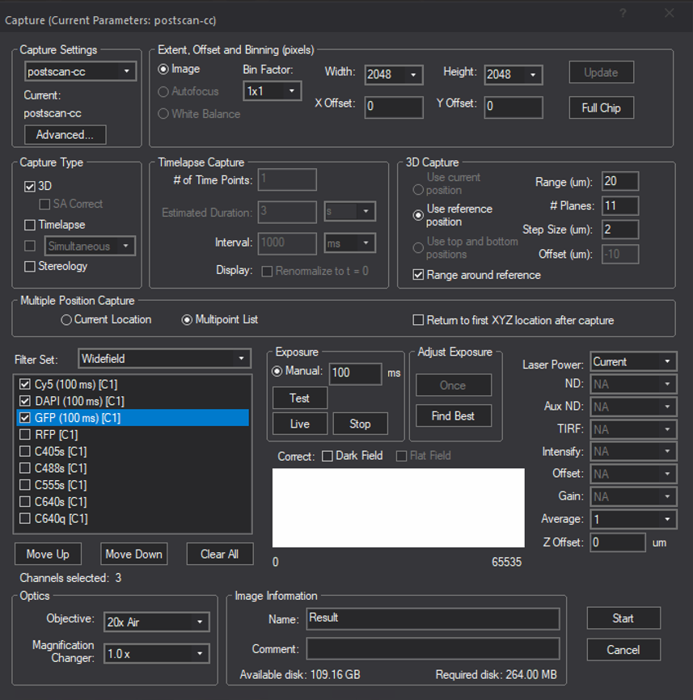

# CelFDrive SlideBook capture-script setup

This guide installs the SlideBook macro that creates a maximum-Z projection, sends it to CelFDrive to find locations of interest, and then runs the returned 6D capture sequence.

## Before you start

- Install and configure CelFDrive on the acquisition computer.
- Confirm that the relevant SlideBook hierarchical capture stream is available.
- Close SlideBook before copying the script so it can discover the new file on restart.

## Install the script

1. In this repository, locate [CelFDrive.sbs](../SlideBook/CelFDrive.sbs).
2. Copy `CelFDrive.sbs` into SlideBook's script directory.
3. To find that directory on a given acquisition computer, open SlideBook and select **Scripting** in the ribbon, then click **Open Scripts Folder**.
4. The folder is normally similar to:

   ```text
   C:\ProgramData\Intelligent Imaging Innovations\SlideBook 2026\Users\Default User\Scripts
   ```

5. Restart SlideBook. The CelFDrive script should now appear in the **Scripting** ribbon.



*The **Scripting** tab contains **Open Scripts Folder**. The script editor shows the four commands in `CelFDrive.sbs`.*

## Configure the objective

Open `CelFDrive.sbs` in a text editor and review this command:

```text
ChangeObjective(Objective = "20x Air")
```

- Replace `20x Air` with the exact name of the objective used on the acquisition system.
- Remove the complete `ChangeObjective(...)` line if the objective is already set in the SlideBook file or should not be changed automatically.

No other edit is normally required for this initial setup.

## Configure high-resolution imaging in CelFDrive

Start the CelFDrive configuration editor from the repository root:

```text
python run_config_gui.py
```

Select the configuration file to use, then open the **High Resolution Imaging** tab. This tab links CelFDrive's detected targets to the SlideBook postscan acquisition.



### SlideBook high-resolution capture

- **Imaging description** is a short note describing the subsequent high-resolution acquisition. It is for human reference.
- **SlideBook postscan script** is the exact name of the postscan script that SlideBook should run for each CelFDrive target. It must match the postscan script created in SlideBook; the supplied default is `floifmHighres`.
- **Capture comment** is attached to the returned capture metadata. Use it to identify the acquisition in SlideBook.
- **Result name format** controls the generated name for each target acquisition. Keep or use the placeholders `{class_name}`, `{x}`, `{y}`, and `{z}` to make results identifiable.

### Detection classes and capture order

Each row defines how CelFDrive handles one class produced by the model.

- **ID** is the model's class ID. With the bundled trained model, do not reorder, remove, or repurpose the existing IDs; they must continue to match the classes used during training.
- **Class name** is the human-readable name shown in generated target names and capture metadata.
- **Minimum confidence** is the detection threshold from `0` to `1`. Raising it produces fewer, more selective targets; lowering it accepts more uncertain detections.
- **Capture priority** controls the order in which targets are returned: `0` is first, then `1`, `2`, and so on. Set a class to `-1` to exclude it without deleting the row.
- **Add detection class** is intended for a model trained with an additional class ID. Do not add arbitrary classes to the bundled model, because it cannot detect classes it was not trained to recognise.

Select **Save** to write changes to the selected configuration. Select **Set as default** only when that configuration should become the repository-wide `celfdrive_predict.yaml` used by CelFDrive.

### Other configuration tabs

- **General** contains the bundled model path and backend. Leave these values unchanged unless deliberately using a different trained model.
- **Image** contains preprocessing and tiling controls. Use the supplied defaults until image quality or size requires a documented adjustment.
- **Coordinates** defines how image detections are converted to stage positions. Keep the existing mode and stage directions unless the microscope coordinate convention has been validated.
- **Advanced** controls logging and plotting output. It is not normally needed for initial SlideBook setup.

## Script sequence

The installed script contains the following commands:

```text
CreateProjectionImage(<current image>, Operation = Maximum, Axis = Z, AutoScaleSum = false, ScaleFactor =1.0)
ChangeObjective(Objective = "20x Air")
RunMatlabHierarchicalCaptureFunction("CelFDrive- Position 1 [16].Project Maximum Z", Function = "find_locations_of_interest_from_montage")
Run6DCapture()
```

In order, these commands create a maximum-intensity Z projection from the current image, optionally change the objective, run the CelFDrive location-finding function on the projection, and acquire the returned targets using SlideBook's 6D capture.

## Configure the search montage and capture window

### 1. Set up the search montage prescan

In SlideBook's **Focus Window**, configure the low-magnification search acquisition as a montage. This prescan is the overview image that CelFDrive uses to locate events of interest.



*Example Focus Window with a montage selected. Set the objective, channel, XY extent, Z settings, and montage layout appropriate for the search acquisition on the target microscope.*

### 2. Configure the capture window

Open the SlideBook capture window and configure the prescan acquisition. Set the **Image Information > Name** field to exactly:

```text
CelFDrive
```

This name is required by the capture script. Configure the selected objective, channel(s), montage, and 3D settings for the overview prescan before starting the capture.



*The capture window must use `CelFDrive` as the image name. This example uses a montage and a 20x Air objective; choose acquisition settings suitable for the local experiment.*

### 3. Run the CelFDrive script after the prescan capture

In the capture window, select **Advanced...**, then select **Conditional Capture** in the left-hand panel.

1. Enable **After Capture**.
2. Select **Run script**.
3. Choose `CelFDrive.sbs` from the script list.
4. Confirm with **OK** (and **Apply** if SlideBook enables it).

Do not enable **Per Time Point** or **Per Location** for this workflow unless the acquisition has been specifically designed and tested for those modes.



*Conditional Capture must run `CelFDrive.sbs` in the **After Capture** section.*

## Create the postscan capture script

CelFDrive needs a SlideBook postscan script that defines the imaging to run at each location it finds. Configure this capture for the desired subsequent imaging, including the objective, channels, exposure, Z range/step size, time points, and multi-position behavior.

The postscan configuration may use a multipoint list, as shown below. CelFDrive supplies the target locations before the final `Run6DCapture()` command is executed.



*Example postscan capture settings. The displayed channels, Z range, objective, and image name are experiment-specific and must be chosen for the intended high-resolution acquisition.*

Save the configured postscan acquisition as a SlideBook script. Its name must match the `highres_script` setting in CelFDrive's prediction configuration. The default supplied configuration uses:

```yaml
profile:
  highres_script: floifmHighres
```

Either create the SlideBook postscan script with that exact name, or change `profile.highres_script` in `celfdrive_predict.yaml` (or through `run_config_gui.py`) to the exact name of the postscan script you created. A mismatch prevents SlideBook from running the intended subsequent imaging.

## Check the installation

1. Restart SlideBook after copying the script.
2. Open the **Scripting** tab and confirm that the CelFDrive script is listed.
3. Confirm that the Focus Window prescan is configured as a montage and the capture window image name is `CelFDrive`.
4. Confirm that **Conditional Capture > After Capture > Run script** is set to `CelFDrive.sbs`.
5. Confirm that a postscan script exists and that its name matches `profile.highres_script` in the CelFDrive prediction configuration.
6. Before using a live experiment, run the workflow on a non-critical test acquisition and verify that the expected capture locations and high-resolution acquisition are returned.

> **Important:** Confirm that the selected objective, capture stream, stage-coordinate convention, and high-resolution capture settings are correct on the target microscope before acquiring experimental data.
